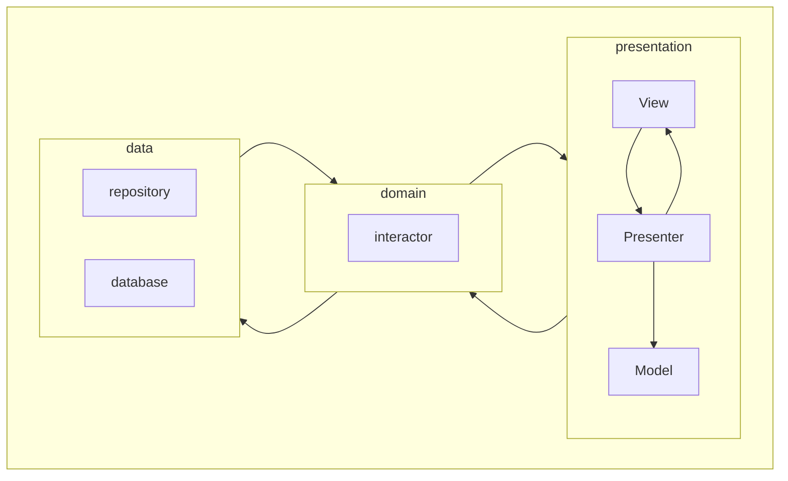

# spectrum
The app for color recognition. The app uses a camera for extracting colors from the picture. It can be one color (from center of the screen) or set of colors (palettes).

# Architecture

# Technologies
- Kotlin
- Coroutines
- Palette
- Glide
- Moxy
- Room
- Hilt
- Navigation component
- Camera2

